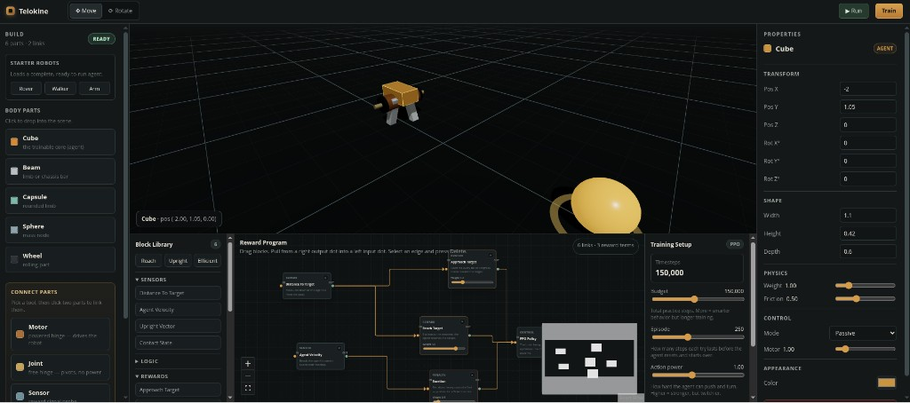

# Telokine

**Build a robot. Define goals with blocks. Press Train. Watch it learn.**

Telokine is a visual AI training sandbox — a 3D playground where you assemble creatures from cubes, wheels, and motors, wire up reward logic with draggable blocks, and train a policy with reinforcement learning. No tensors, no code, no jargon: just build, connect, train, and run.

**Live UI demo:** [https://mateooo93.github.io/Telokine/](https://mateooo93.github.io/Telokine/)

> The hosted demo is the frontend only. Physics and training require the Python backend running locally (see below).

---

## What you can do

| Step | What happens |
|------|----------------|
| **Build** | Drop cubes, beams, wheels, floors, and targets. Load starter robots (Rover, Walker, Arm). |
| **Connect** | Attach motors and joints between parts — click a surface, pick a second part, and the build snaps together. |
| **Program** | Compose reward/penalty blocks in a node canvas (approach target, stay upright, exertion, …). |
| **Train** | PPO learns from your scene and blocks. Every ~10 tries you see a checkpoint preview in the viewport. |
| **Run** | Replay the trained policy and watch the agent reach the goal. |

Movement is **motor-driven only** — like a real robot. A bare cube with no motors cannot locomote; add a **Motor** (and something for it to drive, e.g. a wheel) so the agent can move and learn.

---

## Screenshot



The **Walker** template in the playground: build on the left, 3D viewport in the center, reward program and PPO training setup below, and the Inspector on the right.

---

## Architecture

Three layers, one product:

| Layer | Role | Stack |
|-------|------|--------|
| **Visual** | Editor, viewport, blocks, graphs, buttons | React · Vite · TypeScript · React Three Fiber · Zustand · XYFlow |
| **Simulation** | Gravity, collisions, kinematic tree, MuJoCo MJCF | Python · **MuJoCo** · Gymnasium |
| **Learning** | PPO training, policy rollouts, telemetry | Python · **Stable-Baselines3** · FastAPI · WebSockets |

```
Browser (React)  ←—— WebSocket ——→  FastAPI server
       │                                    │
       │                              MuJoCo sim + PPO
       └──── 3D viewport mirrors live frames from backend
```

**WebSocket channels**

- `/ws/sim` — physics rollout or trained-policy playback (Run button)
- `/ws/train` — training control, reward telemetry, checkpoint preview frames

---

## Quick start (full app)

### 1. Frontend

```bash
npm install
npm run dev
```

Open [http://localhost:1420](http://localhost:1420).

### 2. Backend (simulation + training)

```bash
cd backend
uv sync
uv run uvicorn telokine.server:app --reload --port 8000
```

Health check: [http://localhost:8000/health](http://localhost:8000/health)

With the backend running, **Train** and **Run** stream live physics into the viewport.

### 3. Production build (single server)

```bash
npm run build
cd backend && uv run uvicorn telokine.server:app --port 8000
```

The backend serves the built SPA from `dist/` on the same origin — no CORS setup needed.

---

## Project layout

```
Telokine/
├── src/                    # React app
│   ├── viewport/           # Three.js scene, meshes, placement
│   ├── components/         # Palette, Inspector, BlockCanvas, TopBar, …
│   ├── store/              # Zustand: scene, training, program blocks
│   └── net/                # WebSocket clients (sim + train)
├── backend/
│   └── telokine/
│       ├── sim.py          # Scene → MuJoCo MJCF, kinematic tree, motors
│       ├── env.py          # Gymnasium env (observations, motor actions)
│       ├── train.py        # PPO loop, telemetry, checkpoint previews
│       ├── reward.py       # Reward block compiler
│       └── server.py       # FastAPI + WebSockets
└── docs/
    ├── ARCHITECTURE.md
    └── ROADMAP.md
```

---

## Reward blocks

Blocks in the **Reward Program** canvas compile into per-step rewards for PPO:

**Rewards:** Approach Target · Reach Target · Stay Upright · Move Forward  
**Penalties:** Fall · Touch Wall · Move Backward · Exertion  

Each weighted block maps to a term in `backend/telokine/reward.py`. Templates (**Reach**, **Upright**, **Efficient**) preload sensible defaults.

**Training setup**

| Control | Meaning |
|---------|---------|
| **Budget** | Total practice steps — more training, smarter behavior |
| **Episode** | Steps per try before reset |
| **Action power** | Motor strength multiplier |
| **Curriculum** | Easier early tries, ramp to full difficulty (0 = no ramp) |

---

## Starter robots

| Template | Description |
|----------|-------------|
| **Rover** | Chassis + four wheel motors |
| **Walker** | Legged biped with hip/knee motors |
| **Arm** | Manipulator with joint chain |

Load from the left palette under **Starter robots**. Each template sets the primary body as the **agent** and keeps your target/floor objects.

---

## Connecting parts

1. Choose **Motor** or **Joint** in the palette.  
2. Click a face on **Part A** (anchor).  
3. Click **Part B** — it snaps flush to the connector.  
4. Tune axis and weight in the Inspector; use **Snap Part B to touch** if needed.

Motors become MuJoCo actuators during training; the policy outputs torques on those joints only.

---

## Tech requirements

**Frontend:** Node 20+, npm  
**Backend:** Python 3.12+, [uv](https://github.com/astral-sh/uv), MuJoCo, PyTorch (CPU or CUDA)

Backend tests:

```bash
cd backend && uv run pytest tests/ -q
```

---

## Roadmap

See [`docs/ROADMAP.md`](docs/ROADMAP.md) for the full step list. Recent milestones:

- [x] 3D viewport, selection, gizmos  
- [x] MuJoCo physics + kinematic assembly tree  
- [x] Motor actuators + realistic locomotion (no magic body force)  
- [x] PPO training + live checkpoint previews  
- [x] Visual reward block editor  
- [ ] Save/load projects  
- [ ] Tauri desktop shell  
- [ ] Sharing & marketplace  

---

## License

MIT — use it, fork it, teach with it.

---

Built by [@Mateooo93](https://github.com/Mateooo93).
